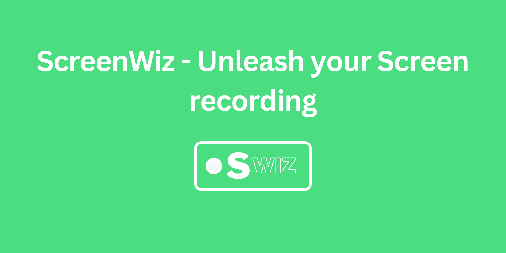

# ScreenWiz

ScreenWiz is a powerful and user-friendly online screen recorder built with JavaScript and the Browser's MediaDevices API. With ScreenWiz, you can effortlessly capture your screen and record high-quality videos directly from your browser.

## Features
- **Easy-to-use Interface:** ScreenWiz provides a sleek and intuitive user interface, making it simple for users to navigate and start recording their screens with just a few clicks.
- **Cross-platform Compatibility:** ScreenWiz works seamlessly on multiple platforms, including Windows, macOS, and Linux, ensuring that users can utilize the screen recording functionality regardless of their operating system.
- **Flexible Recording Options:** Whether you want to capture your entire screen, a specific application window, or a custom-defined region, ScreenWiz offers flexible recording options to suit your needs.
- **Audio Recording:** ScreenWiz allows you to record system audio, microphone input, or a combination of both, giving you complete control over the audio settings during your screen recording sessions.
- **Video Customization:** After recording your screen, ScreenWiz enables you to customize your video by trimming unnecessary sections, adding annotations, or applying filters to enhance the visual quality.
- **Lightweight and Efficient:** Built with performance in mind, ScreenWiz is lightweight and resource-efficient, ensuring smooth recording experiences without putting unnecessary strain on your system.

## Contributing

We welcome contributions to improve ScreenWiz and make it even better. To contribute, please follow these steps:

1. Fork the repository and create your branch from the `main` branch.
2. Make your changes, ensuring they align with the project's coding style and guidelines.
3. Test your changes thoroughly to ensure they work as expected.
4. Commit your changes and push them to your forked repository.
5. Submit a pull request, clearly explaining the changes you have made.

## Feedback and Support
If you have any questions, suggestions, or issues regarding ScreenWiz, please feel free to open an issue. We appreciate your feedback and will address any concerns as quickly as possible.

## License
ScreenWiz is released under the MIT License. You are free to use, modify, and distribute this software for personal or commercial purposes.

## Acknowledgements
ScreenWiz would not have been possible without the valuable contributions of the open-source community. We would like to express our gratitude to all the developers who have contributed to the libraries